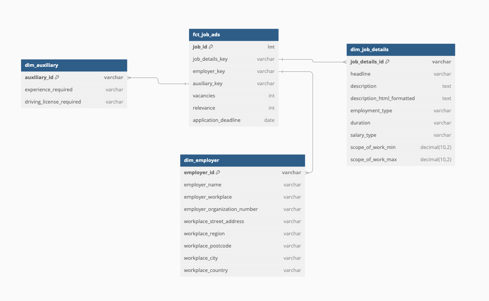
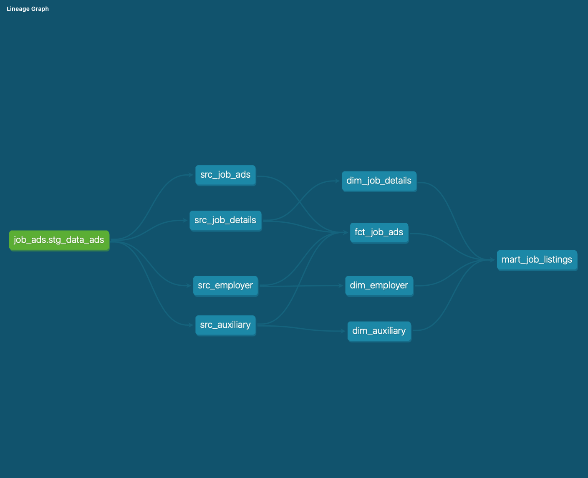

# DWH_DE23_Niloofar

## Project Overview

In this project, I ingested from the Jobsearch API into a Snowflake database, transformed the data and visualized the results. I have used some automated test to check the quality of data as well.

## Data Ingestion and Transformation

- **Staging Schema**: Raw data is initially stored in the staging schema.
- **Dimensional Modeling**: I created three dimension tables and one fact table in the warehouse schema. During this process, the data was cleaned, with null values replaced with appropriate defaults, and certain columns were transformed to ensure the first letter is capitalized.
- **Data Mart View**: Using the tables in the warehouse, I created a view in the marts schema, which serves as the foundation for a dashboard.

### Dimensional Model

Below is a representation of the data model in our warehouse. Note that foreign keys are generated by hashing two unique identifiers from each dimension table.

## Roles and Permissions

I created specific roles for DLT, DBT, and Reporting, which have been assigned to my account (`niloofarmoosavi`). 

- **DLT**: Used for ingesting 100 results with the search keyword "gymnasielärare" from the Jobsearch API.
- **DBT**: Utilized for creating data models in the warehouse and marts schemas, conducting testing, and generating automated documentation.
- **REPORTER**: Utilized for creating the dashboard

### Data Lineage

DBT has built in capabilites like test and documentaion. Below is an automated view of the data lineage created using dbt. Note that source tables are ephemeral, meaning they are not stored in snowflake.

